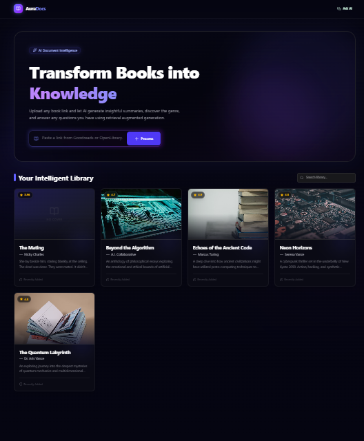
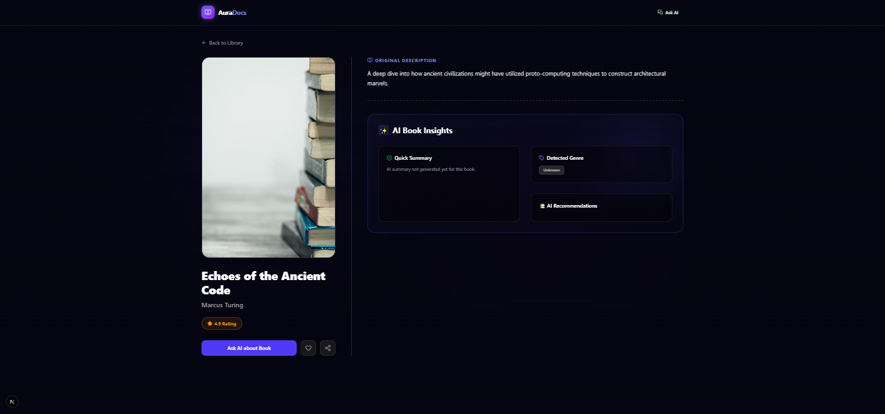
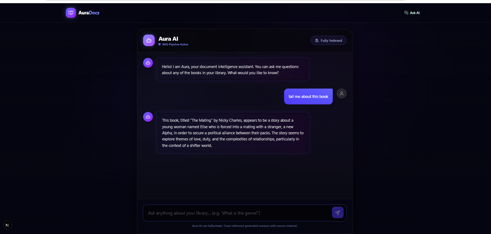

# AuraDocs-Ai
> This project was developed as part of an AI-powered Book Intelligence Platform assignment with RAG-based querying.

<div align="center">

# 📚 AuraDocs AI

**AI-Powered Document Intelligence & RAG Platform**

[](https://nextjs.org/)
[](https://react.dev/)
[](https://tailwindcss.com/)
[](https://www.django-rest-framework.org/)
[](https://www.mysql.com/)
[](https://www.trychroma.com/)

AuraDocs is a full-stack, AI-integrated document intelligence platform that allows users to seamlessly upload book URLs, automatically extract details, store insights in a vector database, and perform advanced Q&A using a complete RAG (Retrieval-Augmented Generation) pipeline.

</div>

---

## ✨ Key Features

- 🤖 **AI-Powered Insights**: Get AI-generated summaries, genre classifications, and book recommendations.
- 💬 **Interactive RAG Q&A**: Ask contextual questions about your library and get accurate answers backed by the vector database.
- 🕷️ **Automated Data Extraction**: Upload a book URL and let Selenium handle the scraping of metadata.
- 🎨 **Premium UI/UX**: Built with Next.js and Tailwind CSS featuring glassmorphism and smooth micro-animations.
- 🧠 **Vector Storage**: Uses ChromaDB and `SentenceTransformers` for advanced semantic embeddings.

---

## 📸 Interface Previews

> **Note:** Add your beautiful screenshots in this section.

| Feature | Preview |
|---|---|
| **Library Dashboard** | <!-- Insert Screenshot Here --> |
| **Book AI Insights** | <!-- Insert Screenshot Here -->  |
| **Q&A Chat Interface** | <!-- Insert Screenshot Here -->  |

---

## 🛠️ Technology Stack

**Frontend**
- Next.js (React)
- Tailwind CSS
- Framer Motion (for animations)

**Backend**
- Python / Django REST Framework
- Selenium (for automated web scraping)
- MySQL (Relational Database)
- ChromaDB (Vector Database)
- SentenceTransformers (Embeddings)
- LLM Integration (OpenAI or Local LM Studio)

---

## 🚀 Getting Started

Follow these steps to set up the project locally.

### 1. Prerequisites

- Python 3.9+
- Node.js 18+
- MySQL Server (running on port 3306)
- *Optional:* LM Studio for local LLM inference

### 2. Database Setup

1. Make sure MySQL is running locally.
2. Create an empty database named `aura_db`:
   ```sql
   CREATE DATABASE aura_db;
   ```
*(Note: ChromaDB utilizes a local persistent directory `./chroma_db` inside the backend automatically. No separate setup is required).*

### 3. Backend Setup

Open a terminal and navigate to the backend directory:

```bash
cd backend

# Create and activate a virtual environment
python -m venv venv
# On Windows:
venv\Scripts\activate
# On macOS/Linux: source venv/bin/activate

# Install Python dependencies
pip install -r requirements.txt

# Run migrations to initialize the MySQL database schema
python manage.py makemigrations
python manage.py migrate

# Start the Django development server
python manage.py runserver
```

### 4. AI Server Configuration (Local vs API)

**Option A: Local Inference (Default)**
The backend defaults to searching for `http://localhost:1234/v1` for a local LM Studio instance.
1. Download [LM Studio](https://lmstudio.ai/).
2. Load a lightweight LLM (e.g., `Llama 3 8B` or `Mistral`).
3. Start the Local Inference Server on port `1234`.

**Option B: OpenAI API**
If you wish to use OpenAI instead of running models locally, set your API key as an environment variable before running the Django server:
```bash
# Windows
set OPENAI_API_KEY=sk-your-openai-api-key

# macOS/Linux
export OPENAI_API_KEY=sk-your-openai-api-key
```

### 5. Frontend Setup

Open a new terminal and navigate to the frontend directory:

```bash
cd frontend

# Install Node modules
npm install

# Start the Next.js development server
npm run dev
```

Visit `http://localhost:3000` in your browser to view the application!

---

## ⚙️ REST API Reference

The backend exposes several endpoints at `http://127.0.0.1:8000/api/`:

| Method | Endpoint | Description |
|---|---|---|
| `GET` | `/api/books/` | Retrieves all uploaded books. |
| `GET` | `/api/books/{id}/` | Retrieves all details for a specific book. |
| `POST` | `/api/upload/` | Scrapes book details, saves it, adds it to ChromaDB, and generates AI insights. |
| `POST` | `/api/qa/` | Generates contextual answers against the vector database for RAG Q&A. |

---

## 🧪 Testing the RAG Pipeline

Once you have added a few books to your library, navigate to the **Ask AI** interface and try these sample queries:

- *"What are the central themes of [Book Name]?"*
- *"Can you explain the ending of the story based on our library?"*
- *"Who are the main protagonists?"*
- *"What does the author suggest about artificial intelligence?"*

---

## 🤝 Contributing

Contributions, issues, and feature requests are welcome!

1. Fork the Project
2. Create your Feature Branch (`git checkout -b feature/AmazingFeature`)
3. Commit your Changes (`git commit -m 'Add some AmazingFeature'`)
4. Push to the Branch (`git push origin feature/AmazingFeature`)
5. Open a Pull Request

---

## 📄 License

Distributed under the MIT License. See `LICENSE` for more information.
